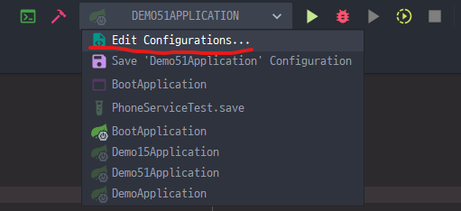
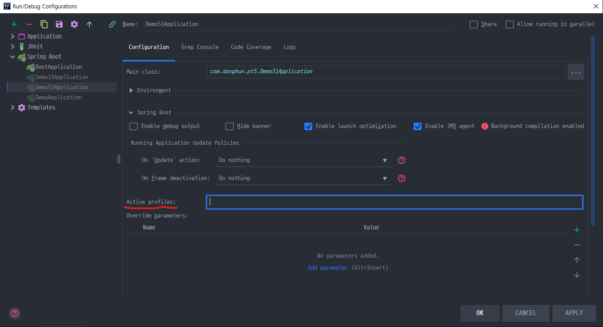
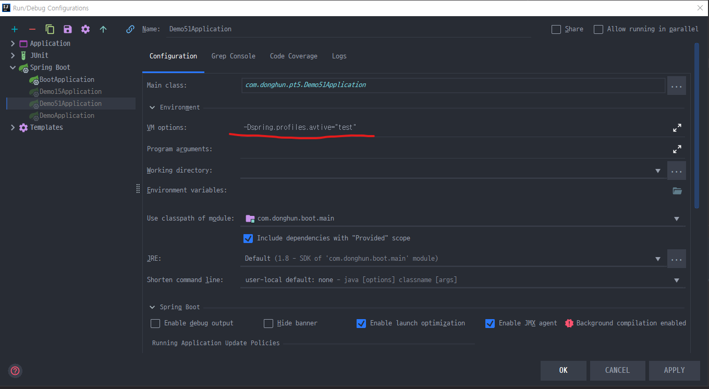

## Study-Notes

### Inversion of Control

  * 의존 관계 주입(Dependency Injection) 이라고도 하며, 어떤 객체가 사용하는 의존 객체를 직접 만들어 사용하는게 아니라, 외부(`IoC Container`)에서 주입 받아 사용하는 방법을 의미.

### Spring IoC Container

  * BeanFactory

  * 애플리케이션 컴포넌트의 중앙 저장소.

  * 빈 설정 소스로부터 빈 정의를 읽어들이고, 빈을 구성하고 제공한다.

### Bean

  * Spring IoC Container가 관리하는 객체.

  * 장점

    * 의존성 관리

    * 스코프

        * 싱글톤 : 하나

          * 싱글톤 스코프로 등록된 빈들은 초기에 다 생성됨. 

          * 등록해야 할 빈이 많을 경우, 초기에 구동시간이 오래 걸릴수 있다.

          * 일단 구동이 되면 또 다른 빈을 만들어 내지는 않기 때문에 구동 이후에는 성능을 많이 잡아먹지 않는다.

        * 프로토타입 : 매번 다른 객체

        * Spring IoC Container에 등록되는 빈들은 기본적으로 싱글톤 스코프로 빈으로 등록 됨.

          * 빈으로 등록 될 때 아무런 어노테이션을 붙이지 않았다면, 그 빈들은 모두 싱글톤 스코프로 빈으로 등록 됨.

    * 라이프 사이클 인터페이스

    * 빈 등록 방법

      * `@Component` 어노테이션과 `@ComponentScan` 어노테이션을 이용한 자동 등록 방법.

        * `@Repository`, `@Service`, `@Controller` 어노테이션을 사용하면, 어노테이션 내부에 `@Component` 어노테이션이 존재하기 때문에 `@SprngBootApplication` 또는 `@ComponentScan` 어노테이션이 사용될 경우, `@Repository`, `@Service`, `@Controller` 어노테이션이 붙은 클래스는 자동으로 Bean으로 등록 된다.

        *  `@SprngBootApplication` 어노테이션 내부에 `@ComponentScan` 어노테이션이 존재해서 `@SprngBootApplication` 어노테이션이 붙은 클래스가 실행 될 경우, `@ComponentScan` 어노테이션의 기능 또한 같이 동작된다.

      * `@Configuration`어노테이션과 `@Bean` 어노테이션을 이용한 수동 등록 방법.

    * 의존성 주입 방법

      * `@Autowired` 어노테이션을 이용하여 의존성 주입을 할 수 있다.

      * 생성자, 세터, 필드를 이용해서 의존성 주입이 가능하다.

### ApplicationContext

  * Spring에서 IoC Container를 구현하는 클래스로써, BeanFactory를 상속받아 구현된다.

    ```java
    @SpringBootApplication
    public class BootApplication {

      @Autowired
      ApplicationContext context;

      // 현재 IoC 컨테이너에 등록된 Bean들의 이름을 출력하는 코드이다.
      // 출력 결과로 현재 등록된 Bean들을 확인할 수 있다.
      // ApplicationContext 클래스를 통해서 IoC 컨테이너에 등록된 Bean들을 관리할 수 있다.
      public static void main(String[] args) {
          String[] beanDefinitionNames = context.getBeanDefinitionNames();
          System.out.println(Arrays.toString(beanDefinitionNames));
      }
    }
    ```

  * BeanFactory

  * 메시지 소스 처리 기능

  * 이벤트 발행 기능

  * 리소스 로딩 기능

### Spring IoC Container의 역할

  * Bean 인스턴스 생성

  * 의존 관계 설정

  * Bean 설정

### ApplicationContext

  * ClassPathXmlApplicationContext(XML)

    * XML 파일로 Bean을 등록할 때, ApplicationContext를 사용하고자 할 때
    <br>

      ```java
        ApplicationContext context = new ClassPathXmlApplicationContext(XML.xml)
      ```

  * AnnotationConfigApplicationContext(Java)

    * Java 방식으로 Bean을 등록할 때, ApplicationContext를 사용하고자 할 때
    <br>

      ```java
        ApplicationContext context = new AnnotationConfigApplicationContext(Java.class)
      ```

### Bean 설정

  * Bean 명세서

  * Bean에 대한 정의를 담고 있음.

    * 이름

    * 클래스

    * 스코프

    * 생성자 Argument(Consturctor)

    * 프로젝트(Setter)

    * ...

### ComponentScan

  * 설정 방법

    * XML 설정에서는 context:component-scan

    * Java 설정에서 `@ComponentScan`

      * `@ComponentScan(basePackageClasses = DemoApplication.class)`

        * basePackageClasses 속성을 줄 경우, 속성에 해당하는 클래스가 위치한 곳부터 ComponentScan을 하라는 것을 의미, 모든 클래스에서 `@Component` 어노테이션이 붙어있는 클래스를 찾아서 Bean으로 등록할 것을 의미한다.

  * 특정 패키지 이하의 모든 클래스 중에 `@Component` 어노테이션을 사용한 클래스를 Bean으로 자동으로 등록 해줌.

### `@Autowire`

  * 필요한 의존 객체의 "타입"에 해당하는 빈을 찾아 주입한다.

  * 모든 Bean들은 Bean으로 등록되어 있으면, `@Autowired` 어노테이션으로 꺼내와서 주입해줄수 있다.

  * `@Autowired`

    * required : 기본 값은 true (따라서 못 찾으면 애플리케이션 구동 실패)

  * 사용할 수 있는 위치

    * 생성자 (스프링 4.3 부터는 생략 가능)

      ```java
      @Service
      public class BookService {

        private final BookRepository bookRepository;

        public BookService(BookRepository bookRepository) {
          this.bookRepository = bookRepository;
        }
      }
      ```

    * Setter

      ```java
      @Service
      public class BookService {

        BookRepository bookRepository;

        @Autowired
        public void setBookRepository(BookRepository bookRepository) {
          this.bookRepository = bookRepository;
        }
      }
      ```

    * Filed

      ```java
      @Service
      public class BookService {
        
        @Autowired
        BookRepository bookRepository;
      }
      ```

  * 경우의 수 

    * 해당 타입의 빈이 없는 경우

    * 해당 타입의 빈이 한 개인 경우

    * 해당 타입의 빈이 여러 개인 경우

      * 빈 이름으로 시도

        * 같은 이름의 빈을 찾으면 해당 빈 사용

        * 같은 이름 못 찾으면 실패

  * 같은 타입의 빈이 여러 개 일 때

    * BookRepository 인터페이스를 구현하는 MyBookRepository 클래스와 DonghunRepository 클래스 두 개의 클래스가 있을 때, BookService는 어떤 BookRepository의 구현체를 주입하는가?

      * BookService 클래스가 다음과 같다고 할 때.

        ```java
        @Service
        public class BookService {

          @Autowired
          BookRepository bookRepository;
        }
        ```

      * 에러가 일어남, 주입을 하지 못한다. 
      
        * MyBookRepository 클래스와 DonghunBookRepository 클래스 중에 어느 레파지토리를 주입해야 하는지 스프링 자체에서 판단하지 못해서 에러가 일어난다.

    * 해결책

      * `@Primary`

        * 둘 중 사용하고자 하는 레파지토리에 `@Primary` 어노테이션을 붙여서 둘 중 어느 레포지토리를 사용할 지에 대해 표기해줄수 있다.
        <br>

        ```java
        @Service
        public class BookService {

          @Autowired
          BookRepository bookRepository;

          public void printBookRepository() {
            System.out.println(bookRepository.getClass());
          }
        }
        ```

        ```java
        @Repository
        public interface BookRepository {
        }
        ```

        ```java
        @Repository @Primay
        public class DonghunBookRepository implements BookRepository {
        }
        ```
        
        ```java
        @Component
        public class BookServiceRunner implements ApplicationRunner {

          @Autowired
          BookService bookService;

          @Override
          public void run(ApplicationArguments args) throws Exception {
            bookService.printBookRepository();
          }
        }   
        ```

        ```java
        >>> 결과적으로 DonghunBookRepository가 주입되는 것을 볼 수 있다.
        ```

      * `@Qualifier`
        
        ```java
        @Service
        public class BookService {

          @Autowired @Qualifier("donghunBookRepository")
          BookRepository bookRepository;

          public void printBookRepository() {
            System.out.println(bookRepository.getClass());
          }
        }
        ```

        ```java
        @Repository 
        public class DonghunBookRepository implements BookRepository {
        }
        ```
        
        ```java
        @Component
        public class BookServiceRunner implements ApplicationRunner {

          @Autowired
          BookService bookService;

          @Override
          public void run(ApplicationArguments args) throws Exception {
            bookService.printBookRepository();
          }
        }   
        ```

        ```java
        >>> 결과적으로 DonghunBookRepository가 주입되는 것을 볼 수 있다.
        ```

      * 해당 타입의 빈 모두를 주입 받는 방법으로 해결할 수 있다.

        ```java
        @Service
        public class BookService {

          @Autowired 
          List<BookRepository> bookRepositories;

          public void printBookRepository() {
            this.bookRepositories.forEach(System.out::println);
          }
        }
        ```

        ```java
        @Repository 
        public class DonghunBookRepository implements BookRepository {
        }
        ```

        ```java
        @Repository 
        public class MyBookRpeository implements BookRepository {
        }
        ```
        
        ```java
        @Component
        public class BookServiceRunner implements ApplicationRunner {

          @Autowired
          BookService bookService;

          @Override
          public void run(ApplicationArguments args) throws Exception {
            bookService.printBookRepository();
          }
        }   
        ```

        ```java
        >>> DonghunBookRepository 와 MyBookRpeository 둘 다 주입된 것을 볼 수 있다.
        ```
    
    * 가장 추천 방법은 `@Primary` 어노테이션을 사용하는 방법.

### `@Component` 와 `@ComponentScan`

  * 컴포넌트 스캔의 주요 기능

    * 컴포넌트 스캔의 중요한 속성 두 가지

      * 어디서부터 어디까지 스캔할지에 대한 속성

      * 어떤 것들을 걸러낼지에 대한 속성

    * 스캔 위치 설정

      * 컴포넌트 스캔은 컴포넌트 스캔의 어노테이션이 있는 클래스를 기준으로 현재 패키지 내에 있는 클래스들과 그 이하 패키지들에 있는 클래스들 중에서 `@Component` 어노테이션이 사용된 클래스를 찾아서 빈으로 등록한다.

      * 즉, 컴포넌트 스캔 어노테이션이 사용된 클래스의 패키지 밖의 있는 클래스들은 `@Component` 어노테이션이 사용되었다고 `@ComponentScan`으로 스캔이 되지 않기 때문에 Bean으로 등록되지 않는다.

      ```java
      package com.donghun.pt3;

      // @SpringBootApplication 어노테이션 내부에 @ComponentScan 어노테이션을 내장하고 있다.
      @SpringBootApplication
      public class DemoApplication {

        @Autowired
        MyService myService;

        public static void main(String[] args) {
          SpringApplication.run(DemoApplication.class, args);
        }
      }
      ```

      ```java
      package com.donghun;

      @Service
      public class MyService {
      }
      ```

      * 위 코드의 경우,  MyService는 빈으로 등록되지 않아서 빈이 주입이 되지 않는 에러가 발생한다. 
      
      * MyService 클래스는 DemoApplication 클래스 패지지 외부에 있기 때문에 `@ComponentScan` 으로 스캔되지 않는다.


  * Filter

    * `@ComponentScan` 어노테이션 내에 필터는 어떤 어노테이션을 스캔 할지 또는 하지 않을지 필터링 해주는 역할을 한다.

    * `@ComponentScan` 어노테이션을 사용한다고 해서 모든 어노테이션들을 처리해서 빈으로 등록해주는 것은 아니다. 걸러주는 필터들이 여럿 존재한다.


  * `@ComponentScan` 사용시 스캔이 되는 대상들

    * `@Component`

    * `@Repository`

    * `@Service`

    * `@Controller`

    * `@Configuration`


  * 동작 원리

    * `@ComponentScan`은 스캔할 패키지와 어노테이션에 대한 정보.

    * 실제 스캐닝은 `ConfigurationClassPostProcessor`라는 `BeanFactoryPostProcessor`에 의해 처리 됨.

    * `BeanFactoryPostProcessor` 인터페이스는 `BeanPostProcessor` 인터페이스와 비슷하나, 실행되는 시점이 다르다.

      * `BeanFactoryPostProcessor` 인터페이스는 다른 모든 빈들을 만들기 이전에 적용을 한다. `BeanFactoryPostProcessor`의 구현체들을 다 적용한다.

      * 다른 빈들(우리가 직접 등록하고자 하는 빈들을 의미한다. ex) BoardService, BoardController.. )을 모두 등록하기 전에, 컴포넌트 스캔을 해서 빈으로 등록을 해준다.


  * Function을 사용한 Bean 등록.

    * 리플렉션과 프록시 기법을 사용하지 않는 방법으로, 스프링 5부터 도입.

      * 리플렉션과 프록시 기법들의 경우, 성능에 영향을 준다.

    * 펑션 기법을 통해 Bean을 등록할 경우, 성능(애플리케이션 구동시간) 상의 이점이 있다.

    * 펑션 기법의 경우, 조건에 따라 빈을 등록 하는 등 프로그래밍적인 컨트롤이 가능하다는 이점이 있다.

    * 하지만, 조금 성능이 올라감으로써 이 방법이 `@ComponentScan`을 대체하기에는 무리가 있다.

      * 모든 빈들을 매번 이와 같이 등록할 경우, 꽤 번거로운 작업이 될것이기 떄문이다.    

    * Code Example

      ```java
      public static void main(String[] args) {
        new SpringApplicationBuilder()
            .sources(DemoSpringApplication.class)
            .initializers((ApplicationContextInitializer<GenericApplicationContext>)
            applicationContext -> {
              applicationContext.registerBean(MyBean.class);
            })
            .run(args);
      }
      ```

### Bean의 스코프

  * 스코프

    * 싱글톤

      * 애플리케이션 전반에 걸쳐서 해당 빈의 인스턴스가 오직 한 개만 생성되는 것.

    * 프로토타입

      * Request

      * Session

      * WebSocket

      * ...

  * 프로토타입 빈이 싱글톤 빈을 참조하면?

    * 아무 문제 없다.

    * 싱글톤 빈의 경우, 하나의 인스턴스만 생성되기 때문에 상관이 없다.

      ```java
      @Component
      @Scope(value = "prototype")
      public class Proto {

        @Autowired
        Single single

        public Single getSingle() {
          return single;
        }
      }
      ```

      ```java
      @Component
      public class Single {
      }
      ```

  * 싱글톤 빈이 프로토타입 빈을 참조하면

    * 프로토타입 빈이 업데이트가 안된다.

      * 싱글톤 빈이 프로토타입 빈을 참조하면, 싱글톤 빈은 하나의 인스턴스만 생성 되기 때문에 프로토타입 빈을 꺼내올 때마다, 업데이트 되지 않는다.

        ```java
        @Component
        @Scope(value = "prototype")
        public class Proto {
        }
        ```

        ```java
        @Component
        public class Single {
          @Autowired
          Proto proto;

          public Proto getProto() {
            return proto;
          }
        }
        }
        ```

        ```java
        @Component
        public class AppRunner implements ApplicationRunner {

          @Autowired
          ApplicationContext ctx;

          @Override
          public void run(ApplicationArguments args) throws Exception {

            System.out.println("Proto");

            System.out.println(ctx.getBean(Proto.class));
            System.out.println(ctx.getBean(Proto.class));
            System.out.println(ctx.getBean(Proto.class));

            System.out.println("Single");

            System.out.println(ctx.getBean(Single.class));
            System.out.println(ctx.getBean(Single.class));
            System.out.println(ctx.getBean(Single.class));

            System.out.println("Proto by single");

            System.out.println(ctx.getBean(Single.class).getProto());
            System.out.println(ctx.getBean(Single.class).getProto());
            System.out.println(ctx.getBean(Single.class).getProto());

          }
        }
        ```

        ```java
        /* 출력 결과 */

        Proto
        com.donghun.pt4.Proto@6548bb7d
        com.donghun.pt4.Proto@e27ba81
        com.donghun.pt4.Proto@54336c81

        Single
        com.donghun.pt4.Single@1556f2dd
        com.donghun.pt4.Single@1556f2dd
        com.donghun.pt4.Single@1556f2dd

        Proto by single
        com.donghun.pt4.Proto@7561db12
        com.donghun.pt4.Proto@7561db12
        com.donghun.pt4.Proto@7561db12
        ```

    * 업데이트를 하기 위해선?

      * scoped-proxy

        * 프로토타입 빈을 싱글톤 빈이 직접적으로 참조를 하면 업데이트가 되지 않기 떄문에, 프록시 인스턴스로 프로로토타입 빈을 한번 감싸는 형태로 만드는 것으로 해결할 수 있다. 

        * 프록시 인스턴스로 감싼 프로토타입 빈을 싱글톤 빈이 참조하게 되면, 싱글톤 빈이 참조될 때마다, 그 안에 참조되는 프로토타입 빈도 새로운 인스턴스로 생성되어 업데이트 될 수 있다.

        ```java
        @Component
        @Scope(value = "prototype", proxyMode = ScopedProxyMode.TARGET_CLASS)
        public class Proto {
        }
        ```

        ```java
        @Component
        public class AppRunner implements ApplicationRunner {

          @Autowired
          ApplicationContext ctx;

          @Override
          public void run(ApplicationArguments args) throws Exception {

            System.out.println("Proto");

            System.out.println(ctx.getBean(Proto.class));
            System.out.println(ctx.getBean(Proto.class));
            System.out.println(ctx.getBean(Proto.class));

            System.out.println("Single");

            System.out.println(ctx.getBean(Single.class));
            System.out.println(ctx.getBean(Single.class));
            System.out.println(ctx.getBean(Single.class));

            System.out.println("Proto by single");

            System.out.println(ctx.getBean(Single.class).getProto());
            System.out.println(ctx.getBean(Single.class).getProto());
            System.out.println(ctx.getBean(Single.class).getProto());

          }
        }
        ```

        ```java
        /* 출력 결과 */

        Proto
        com.donghun.pt4.Proto@6548bb7d
        com.donghun.pt4.Proto@e27ba81
        com.donghun.pt4.Proto@54336c81

        Single
        com.donghun.pt4.Single@1556f2dd
        com.donghun.pt4.Single@1556f2dd
        com.donghun.pt4.Single@1556f2dd

        Proto by single // 매번 다른 인스턴스로 생성되는 것을 볼 수 있다.
        com.donghun.pt4.Proto@44ea608c
        com.donghun.pt4.Proto@50cf5a23
        com.donghun.pt4.Proto@450794b4
        ```

      * Object-Provider

        ```java
        @Component
        @Scope(value = "prototype")
        public class Proto {
        }
        ```

        ```java
        @Component
        public class Single {
          @Autowired
          private ObjectProvider<Proto> proto;

          public Proto getProto() {
            return proto.getIfAvailable();
          }
        }
        }
        ```

  * [프록시](https://en.wikipedia.org/wiki/Proxy_pattern)

  * 싱글톤 객체 사용시 주의할 점

    * 프로퍼티가 공유.

      ```java
        @Component
        public class Single {
          @Autowired
          Proto proto;

          int value = 0;

          public Proto getProto() {
            return proto;
          }
        }
        }
        ```

        * Single Bean의 value 값이 안정적이라고 보장할수가 없다.

    * ApplicationContext 초기 구동시 인스턴스 생성.

### 스프링 부트의 테스트 어노테이션 정리.

  * `@SpringBootTest`

    * 통합 테스트를 제공하는 기본적인 스프링 부트 테스트 어노테이션

    * 애플리케이션이 실행될 때의 설정을 임의로 바꾸어 테스트를 진행할 수 있음.

    * 여러 단위 테스트를 하나의 통합된 테스트로 수행할 때 적합한 테스트 어노테이션.

    * 스프링 부트 1.4 버전부터 제공, 스프링 부트 프로젝트를 만들면 메인 클래스와 함께 기본으로 제공.

    * 스프링 부트 테스트 어노테이션들 중에서 `@SpringBootTest` 어노테이션은 만능임.

      * 장점

        * 실제 구동되는 애플리케이션과 똑같이 애플리케이션 컨텍스트를 로드하여 테스트 하기 때문에 하고 싶은 테스트를 모두 수행할 수 있음.

      * 단점

        * 애플리케이션에 설정된 빈을 모두 로드하기 때문에 애플리케이션 규모가 클수록 느려지기 때문에, 단위 테스트라는 의미가 희석됨.

    * 사용할 때는 항상 `@RunWith(SpringRunner.class)`와 같이 사용해야 함.

      * `@RunWith` 어노테이션을 사용하면 JUnit에 내장된 러너를 사용하는 대신 어노테이션에 정의된 러너 클래스 사용.

      * `@SpringBootTest` 어노테이션을 사용하기 위해서는 JUnit 실행에 필요한 SpringJUnit4ClassRunner 클래스를 상속받은 `@RunWith(SpringRunner.class)`를 꼭 붙여 줘야함. 그러지 않을 경우, 정상적으로 동작하지 않는다.

  * `@WebMvcTest`

    * WEB에서 MVC를 위한 테스트이며, 웹에서 테스트 하기 힘든 컨트롤러를 테스트 하는데 적합함.

    * 웹에서 요청(Request)과 응답(Response)에 대해 테스트가 가능하며, 시큐리티 혹은 필터까지 자동으로 테스트하며 수동으로 추가/삭제까지 가능.

    * `@WebMvcTest`를 사용하면 MVC 관련 설정인 `@Controller`, `@ControllerAdvice`, `@JsonComponent`와  `Filter`, `WebMvcConfigurer`, `HandlerMethodArgumentResoler`만 로드하기 때문에, `@SpringBootTest` 어노테이션보다 가볍게 테스트가 가능.

  * `@DataJpaTest`

    * `@DataJpaTest` 어노테이션은 JPA 관련 테스트 설정만 로드.

    * DataSource의 설정이 정상적인지, JPA를 사용하여 데이터를 제대로 생성, 수정, 삭제 하는지 등의 테스트가 가능.

    * 내장형 데이터베이스를 사용하여 실제 데이터베이스를 사용하지 않고 테스트 데이터베이스로 테스트 할 수 있다.

  * `@DataJpaTest`

    * `@DataJpaTest` 어노테이션은 JPA 관련 테스트 설정만 로드한다.

    * DataSource의 설정이 정상적인지, JPA를 사용하여 데이터를 제대로 생성, 수정, 삭제하는지 등의 테스트가 가능하다.

    * 내장형 데이터베이스를 사용하여 실제 데이터베이스를 사용하지 않고 테스트 데이터베이스로 테스트를 할 수 있다.

      * 즉, 테스트의 내용이 실제 DB에 반영되지 않는다.

      * JPA 테스트가 끝날 때마다 자동으로 테스트에 사용한 데이터를 롤백한다.

    * 기본적으로 인메모리 임베디드 데이터베이스를 사용하며, `@Entity` 어노테이션을 스캔하여 스프링 데이터 JPA 저장소를 구성한다. 

  * `@RestClientTest`

    * REST 관련 테스트를 도와주는 어노테이션.

    * REST 통신의 데이터 형으로 사용되는 JSON 형식이 예상대로 응답을 반환하는지 등을 테스트 할 수 있다.

  * `@JsonTest`

    * `@JsonTest` 어노테이션은 JSON의 직렬화와 역질렬화를 수행하는 라이브러리인 Gson과 Jackson API의 테스트를 제공한다.

    * 각각 GsonTest와 JacksonTest를 사용하여 테스트를 수행한다.
    
### Environment #1, Profile.

  * Profile일과 Property를 다루는 인터페이스.

  * ApplicationContext extends EnvironmentCapable

    * `getEnvironment()`

  * Profile

    * 빈들의 그룹

    * Environment의 역할은 활성화 할 프로파일 확인 및 설정.

  * Profile 을 사용하기 좋은 상황들.

    * 테스트 환경에서는 A라는 빈을 사용하고, 배포 환경에서는 B라는 빈을 쓰고 싶다.

    * 이 빈은 모니터링 용도니까, 테스트 할 때는 필요가 없고 배포할 때만 등록이 되면 좋겠다.

  * Profile 정의하기

    * 클래스에 정의

      * `@Configuration @Profile('test')`

        ```java
        @Configuration
        @Profile("test")
        public class TestConfiguration {

          @Bean
          public StudentRepository studentRepository() {
            return new TestStudentRepository();
          }
        }
        ```

      * `@Component @Profile('test')`

        ```java
        @Repository
        @Profile("test")
        public class TestStudentRepository implements StudentRepository {
        }
        ```

    * 메소드에 정의

      * `@Bean @Profile('test')`

        ```java
        @Configuration
        @Profile("test")
        public class TestConfiguration {

          @Bean
          public StudentRepository studentRepository() {
            return new TestStudentRepository();
          }
        }
        ```

  * Profile 설정하기

    * `-Dspring.profiles.avtive = 'test, A, B, ...'`

      * Edit Configurations.. 에 들어가기.

        

      * Active Profiles 에 지정한 프로파일의 이름을 넣어주기.

        

      * Active Profiles 가 없을 경우, Enviroment 라는 탭을 열어서 vm option에 `-Dspring.profiles.avtive = "test"` 라고 넣어주면 된다.

        

    * `@ActiveProfiles` (테스트용)


  * Profile 표현식

    * !(not)

    * &(and)

    * |(or)

      ```java
        @Repository
        @Profile("!prod & test")
        public class TestStudentRepository implements StudentRepository {
        }
      ```

### Environment #2, Property.

  * Property

    * 다양한 방법으로 정의할 수 있는 설정 값.

    * [Environment](https://docs.spring.io/spring-framework/docs/current/javadoc-api/org/springframework/core/env/Environment.html)의 역할은 Property 소스 설정 및 프로퍼티 값 가져오기.

  * Property에는 우선순위가 존재.

    * StandardServletEnvironment의 우선순위

      * ServletConfig 매개변수

      * ServeltContext 매개변수

      * JNDI(java.comp/env/)

      * JVM 시스템 프로퍼티(-Dkey="value")

      * JVM 시스템 환경 변수 (운영체제 환경 변수)

  * `@PropertySource`

    * Environment를 통해 프로퍼티 추가하는 방법

  * 스프링 부트의 외부 설정 참고

    * 기본 프로퍼티 소스 지원(application.properties).

      ```java
      // app.properties 파일

      app.about = spring
      ```

      ```java
      @SpringBootApplication
      @PropertySource("classpath:/app.properties")
      public class Deno123Application {

        public static void main(String[] args) {
          SpringApplication.run(Deno123Application.class);
        }
      }
      ```

      ```java
      @Component
      public class AppRunner2 implements ApplicationRunner {

        @Autowired
        ApplicationContext applicationContext;

        @Autowired
        BasicRepostiory basicRepostiory;

        @Value("${app.about}")
        String appAbout;

        @Override
        public void run(ApplicationArguments args) throws Exception {
          Environment environment = applicationContext.getEnvironment();
          System.out.println(environment.getProperty("app.about"));
          System.out.println(appAbout);
        }
      }
      ```

      ```java
      // 출력 결과
      spring
      spring
      ```

    * Profile까지 고려한 계층형 프로퍼티 우선 순위 제공.
